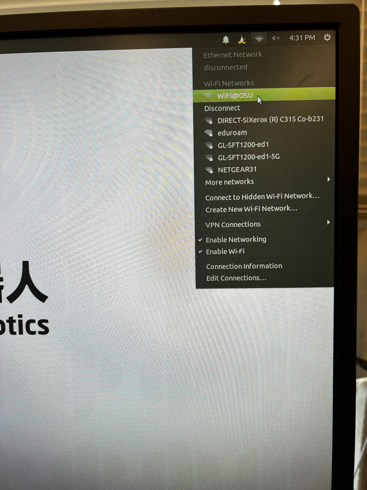
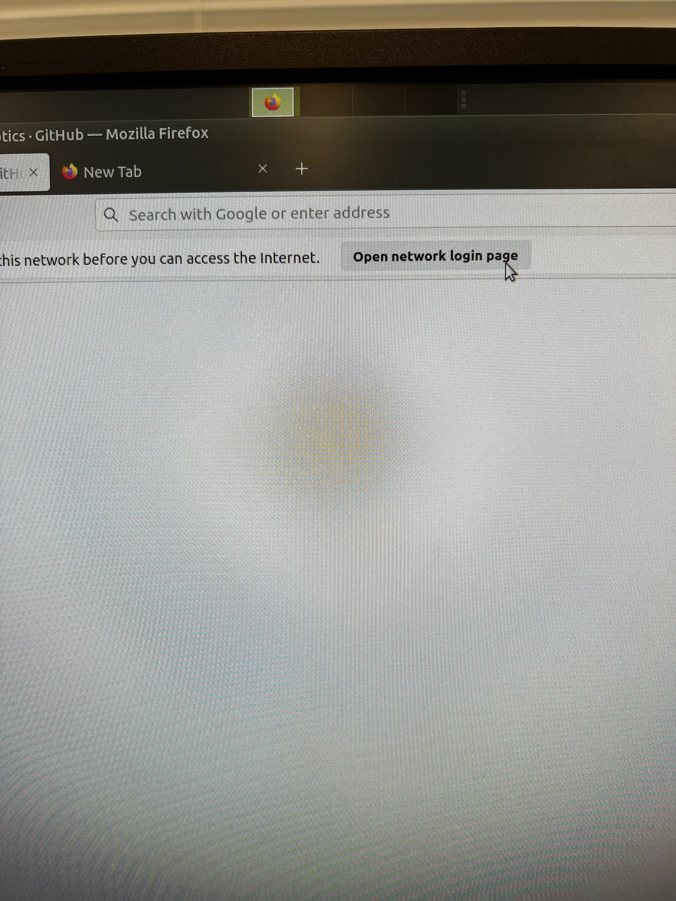
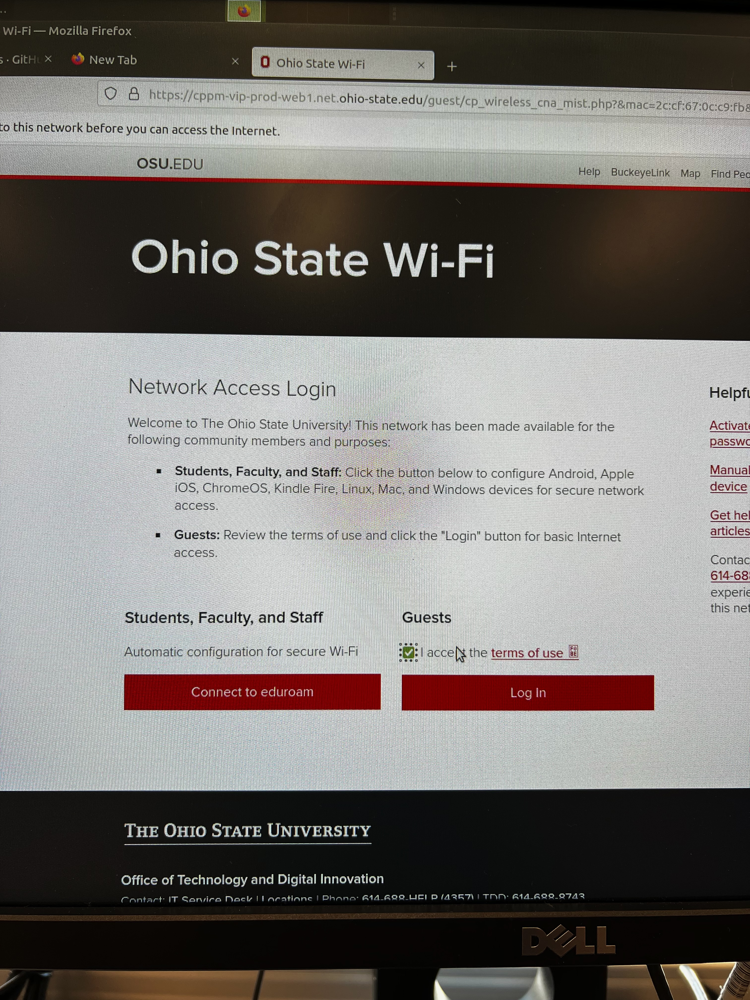
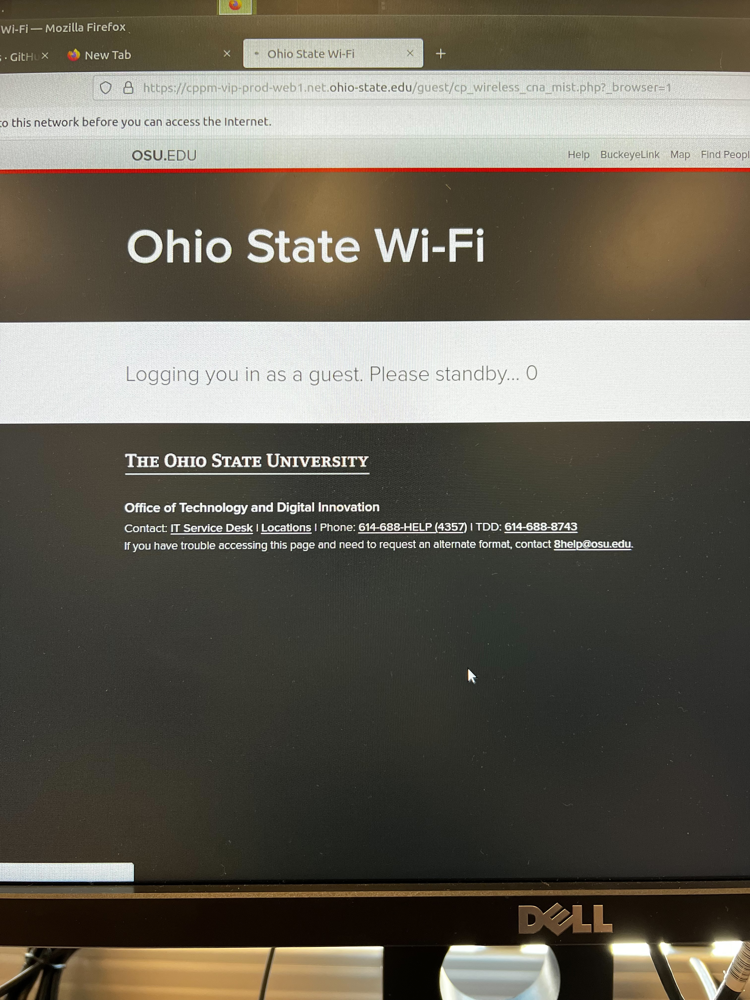
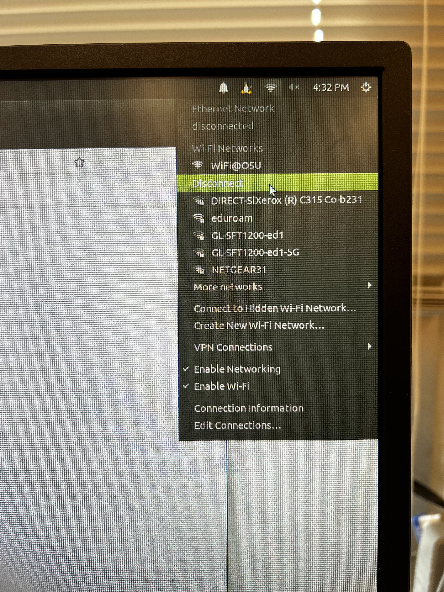
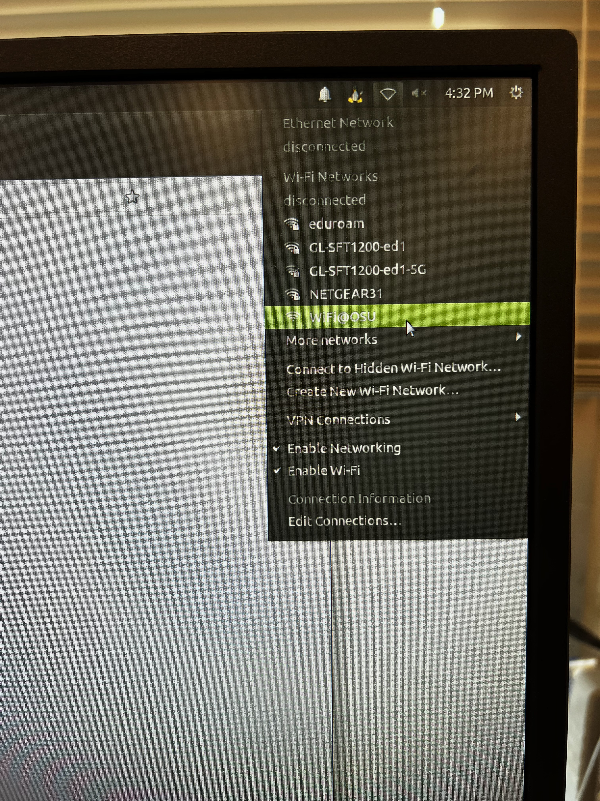
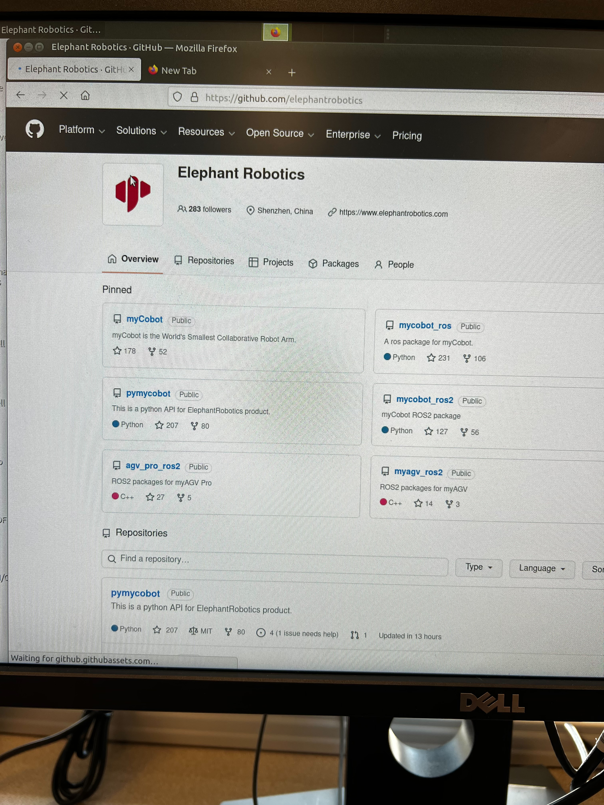

HOW TO CONNECT TO WIFI@OSU RELIABLY 
1. Select WiFi@OSU from the available networks
   
2. Open a web browser and click to open the network login page (if the prompt to open the network login page does not appear, manually go to: https://cppm-vip-prod-web1.net.ohio-state.edu/guest/cp_wireless_cna_mist.php?&mac=ce:ad:31:cf:15:ce&_browser=1)
   
3. Under Guests, check the box to accept terms of use, then click Log In
   
4. Wait until the Please standby timer counts to 0. If the browser successfully opens the osu home page, then you are connected to the network. If not, go to step 5
   
   
5. Close the network login page tab and disconnect from WiFi@OSU
   
6. Reconnect to WiFi@OSU
   
You should now be connected to the network. Try accessing a website to confirm that you have successfully connected. The connection should hold even after restarting the device, until ~4:00am when the network resets and all devices must be reconnected

